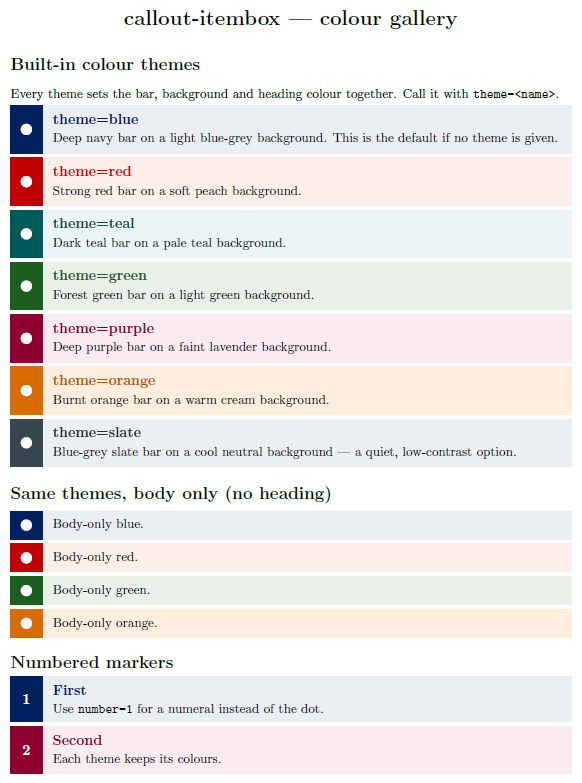
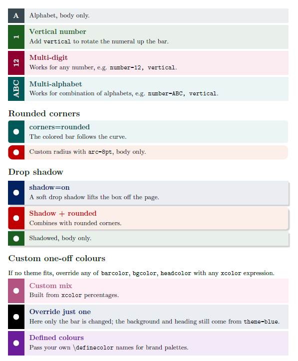

# callout-itembox - colored callout item/numbered boxes for LaTeX (document/Beamer)

A small LaTeX package for **colored callout item/numbered boxes** with a tinted background, a
colored side bar with circular/numbered marker. Each box can show a bold
colored heading plus body text, or body text only.

**Quick Usage:** drop `callout-itembox.sty` next to your `.tex` file. 
```latex
\usepackage{callout-itembox}

% heading + body
\callout{Primary Objective}{To establish a correlation between mechanical
axis correction and plantar pressure distribution.}

% body only (starred)
\callout*[theme=red]{All parameters recorded pre- and post-operatively.}

% numbered marker, rounded corners
\callout[theme=green, number=1, corners=rounded]{Step one}{First do this.}
```




## Features

- Colored side bar + matching light background, set together by a single `theme`.
- Seven built-in themes: `blue` (default), `red`, `teal`, `green`, `purple`,
  `orange`, `slate`.
- Two layouts: **heading + body** (`\callout`) or **body only** (`\callout*`).
- Marker is a white dot by default, or a white number with `number=<n>`.
- Sharp (default) or rounded corners; the bar follows the corner radius.
- Optional soft drop shadow (`shadow=on`).
- One-off color overrides via `barcolor`, `bgcolor`, `headcolor`.
- Boxes are breakable across pages.

## Requirements

A LaTeX engine (pdfLaTeX, XeLaTeX, or LuaLaTeX) with `tcolorbox`, `tikz`,
`xparse`, and `xcolor` — all part of a standard TeX Live / MiKTeX install.

## Installation

**Quick (per project):** drop `callout-itembox.sty` next to your `.tex` file.

**System-wide (TeX Live / MiKTeX):**

```sh
# find your local texmf tree, e.g. ~/texmf on Linux/macOS
mkdir -p $(kpsewhich -var-value TEXMFHOME)/tex/latex/callout-itembox
cp callout-itembox.sty $(kpsewhich -var-value TEXMFHOME)/tex/latex/callout-itembox/
mktexlsr   # or texhash; MiKTeX: refresh the FNDB
```

## Usage Options

All options go in the optional `[...]` argument as `key=value`, comma-separated.

| Key         | Values / type                  | Default  | Description                              |
|-------------|--------------------------------|----------|------------------------------------------|
| `theme`     | `blue` `red` `teal` `green` `purple` `orange` `slate` | `blue` | Sets bar, background, and heading color. |
| `number`    | integer                        | (off)    | Show a number instead of the dot marker. |
| `corners`   | `sharp` `rounded`              | `sharp`  | Corner style.                            |
| `arc`       | length (e.g. `8pt`)            | `0pt`    | Custom corner radius (overrides `corners`). |
| `shadow`    | `on` `off`                     | `off`    | Soft drop shadow behind the box.         |
| `barcolor`  | any `xcolor` expression        | theme    | Override the side-bar color.             |
| `bgcolor`   | any `xcolor` expression        | theme    | Override the background color.           |
| `headcolor` | any `xcolor` expression        | theme    | Override the heading color.              |
| `barwidth`  | length                         | `0.95cm` | Width of the colored side bar.           |
| `gap`       | length                         | `0.2cm` | Space between the bar and the text.      |

The star (`\callout*`) switches to the body-only layout regardless of theme.

## Examples

See [`demo.tex`](demo.tex) for a full color gallery; the compiled result is in
[`demo.pdf`](demo.pdf). Build it with:

```sh
pdflatex demo.tex
```

## License

MIT — see [LICENSE](LICENSE). (If you intend to publish on CTAN, the LaTeX
Project Public License 1.3c is the conventional choice; swap the license file
and the header in `callout-itembox.sty` accordingly.)
